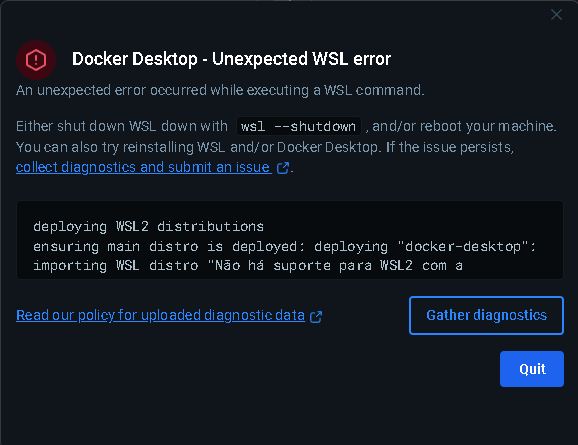

# API de Autenticação e Gestão de Produtos - JWT

**Versão:** 1.0.0  
**Especificação:** OAS 3.0  
**URL da Documentação Swagger:** [http://localhost:8080/swagger-ui/index.html](http://localhost:8080/swagger-ui/index.html)  

---

## 📄 Descrição

Esta API fornece funcionalidades de autenticação via JWT e acesso a endpoints protegidos para gerenciamento de produtos e categorias.

---

## 🚀 Tecnologias Utilizadas

- Java 21  
- Spring Boot 3.5.3  
- Spring Security  
- Spring Data JPA  
- H2 Database  
- JWT (JSON Web Token)  
- Swagger / OpenAPI  
- Spring Boot Actuator  (opcional para acompanhamento de métricas)
- Prometheus  (opcional para acompanhamento de métricas)
- Docker (opcional para deploy com container)

---

## ⚙️ Pré-requisitos

- Java 21 instalado  
- Maven ou Wrapper (`mvnw`)  
- Docker instalado (opcional para deploy com container)

---

## 🔐 Funcionalidades de Autenticação

- **Login:** Usuário e senha via endpoint `/auth/login`  
- **Validação de Token:** Endpoint `/auth/validate` para verificar validade do JWT  
- **Acesso autenticado:** Endpoint `/hello` acessível por qualquer usuário autenticado  
- **Acesso restrito:** Endpoint `/admin` disponível apenas para usuários com a role `ADMIN`  

---

## 🧪 Usuários Criados pelo SecurityConfig

| Username | Senha | Papel       |
|----------|-------|-------------|
| admin    | 123456   | ROLE_ADMIN  |
| user     | password   | ROLE_USER   |

---

## 🔐 Login no Swagger

1. Acesse: [http://localhost:8080/swagger-ui.html](http://localhost:8080/swagger-ui.html)  
2. Faça um `POST` em `/auth/login` com o seguinte payload:

```json
{
  "username": "admin",
  "password": "123456"
}
```
3. Copie o token JWT retornado.

4. No Swagger, clique em Authorize e insira: SEU_TOKEN

---

## 📦 Endpoints de Produto (`/produto`)

| Método | Endpoint          | Descrição                                | Permissão              |
|--------|-------------------|-----------------------------------------|-----------------------|
| GET    | `/produto`        | Listar todos os produtos                 | USER e ADMIN          |
| GET    | `/produto/{id}`   | Buscar produto por ID                    | USER e ADMIN          |
| POST   | `/produto`        | Cadastrar novo produto                   | Usuário autenticado   |
| PUT    | `/produto/{id}`   | Atualizar produto                        | Usuário autenticado   |
| DELETE | `/produto/{id}`   | Remover produto                         | Apenas ADMIN          |

---

## 🗂️ Endpoints de Categoria (`/categoria`)

| Método | Endpoint          | Descrição                                | Permissão              |
|--------|-------------------|-----------------------------------------|-----------------------|
| GET    | `/categoria`      | Listar todas as categorias               | USER e ADMIN          |
| GET    | `/categoria/{id}` | Buscar categoria por ID                  | USER e ADMIN          |
| POST   | `/categoria`      | Cadastrar nova categoria                 | Usuário autenticado   |
| PUT    | `/categoria/{id}` | Atualizar categoria                      | Usuário autenticado   |
| DELETE | `/categoria/{id}` | Remover categoria                        | Apenas ADMIN          |

---

## ✅ Como usar

1. Faça login em `/auth/login` com seu usuário e senha.  
2. Copie o token JWT retornado.  
3. Valide o token em `/auth/validate` se desejar.  
4. Clique no botão **Authorize** no topo da página do Swagger UI.  
5. Cole o token no formato: `Bearer seu_token_aqui`  
6. Agora você pode testar os endpoints protegidos com o token.  

---

## ⚙️ Configuração Inicial

1. Configure o banco de dados MySQL no arquivo `application.yml`.  
2. Execute a criação do banco e tabelas conforme necessário (via scripts ou JPA Hibernate).  
3. Rode a aplicação Spring Boot.  
4. Acesse a documentação Swagger via:  
   `http://localhost:8080/swagger-ui/index.html`

---
### ✔️ Testes com JUnit 5 e Mockito

Os testes automatizados foram implementados com **JUnit 5** e **Mockito**, garantindo a validação das funcionalidades principais dos controladores.

- Todos os testes unitários foram executados com **100% de sucesso**.

#### Controladores testados:

- `ProdutoController`  
- `CategoriaController`  
- `AuthController`  

Esses testes asseguram o correto comportamento dos endpoints e a integração entre as camadas da aplicação.

---

### 📊 Teste de Carga com JMeter

Foi elaborado um **plano de teste de carga com o Apache JMeter**, visando avaliar o desempenho da API sob múltiplas requisições simultâneas.

- O plano de teste foi executado com **100% de êxito**, sem falhas durante os testes de stress.
- O arquivo com o plano está salvo na raiz do projeto com o nome:  
  **`Plano de Teste.jmx`**

Isso permite que o desempenho da aplicação seja reavaliado futuramente com facilidade.
---

## 🚚 Deploy e Docker

### 🐳 Tentativa de Containerização com Docker

Foi realizada a tentativa de criar um `Dockerfile` para facilitar o deploy da aplicação. No entanto, o processo foi interrompido por limitações no ambiente local:

- Erro relacionado ao WSL (Windows Subsystem for Linux), exigindo atualização ou ativação no setup da BIOS.
- A impossibilidade de utilizar Docker impediu testes locais com containers.

#### 🖼️ Erro apresentado:


Apesar disso, todo o projeto está preparado para futura containerização e deploy em ambientes como **Railway**, **Render** ou servidores próprios, bastando resolver a limitação do ambiente local.

### 🔧 Sugestões Futuras

- Corrigir o erro de WSL/BIOS para permitir o uso do Docker Desktop.
- Utilizar o `Dockerfile` e `docker-compose.yml` para facilitar deploy com MySQL containerizado.
- Avaliar deploy em nuvem com suporte nativo a aplicações Spring Boot (como [Railway](https://railway.app) ou [Render](https://render.com)).

---

> 💡 Caso deseje executar o projeto localmente, recomenda-se rodar a aplicação diretamente via Spring Boot (`mvn spring-boot:run`) após configurar o banco MySQL no `application.yml`.

---

## Licença

Este projeto está licenciado sob a licença **Apache 2.0**.

---

## Contato

- Kevin Thiago dos Santos   
- Email: kevinthiago126@gmail.com  

---

## Servidores

- `http://localhost:8080` - Servidor local para desenvolvimento e testes.

---

> **Observação:** Todos os endpoints que requerem autenticação JWT estão protegidos e exigem token válido para acesso.
